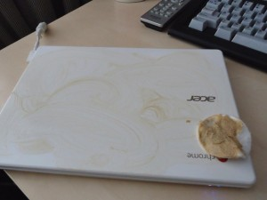
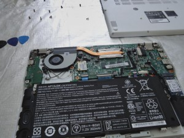
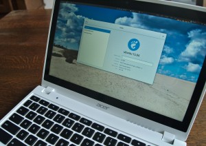
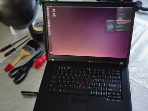

// ---
// tags: [free software, Digital Freedom]
// ---
= My C720P upgrade to freedom
:author:   Nico Rikken
:revdate:  2015-05-05
:navicons:
:nav-home: <<../index.adoc#,home>>
:nav-up:   <<index.adoc#,posts>>
:nav-next: <<2015-05-05-gajim-and-gpg-agent.adoc#,Gajim and GPG agent>>

nav::[]

A couple of years ago I started using my own laptop at work under the policy of link:https://en.wikipedia.org/wiki/Bring_your_own_device[bring your own device] although to me it wasn’t about the device, it was about bringing a free computing platform I can trust, a GNU/Linux distribution, and many free and powerful applications, all to improve my short-term and long-term effectivenes link:http://nicorikken.eu/blog/why-engineering-students-need-to-be-taught-free-software/[as an engineer]. This however changed my needs regarding battery life, screen brightness and form-factor. And with the recent dying of my Lenovo Thinkpad T60p, I desired an upgrade, to be able to destine my current Lenovo Thinkpad T61 to become my backup.

Currently there are plenty of interesting developments regarding more free laptop projects, which are even destined to pass the FSF link:https://www.fsf.org/resources/hw/endorsement/respects-your-freedom[Respects Your Freedom] certification. Specifically the link:https://www.crowdsupply.com/sutajio-kosagi/novena[Novena laptop], the link:https://www.fsf.org/news/libreboot-x200-laptop-now-fsf-certified-to-respect-your-freedom[Libreboot X200], link:https://github.com/bibanon/Coreboot-ThinkPads/wiki[other corebooted Thinkpads], the link:https://www.crowdsupply.com/purism/librem-15[Librem laptop], and the link:http://nicorikken.eu/blog/why-eoma68-will-advance-both-free-software-and-free-hardware/[EOMA68] link:http://rhombus-tech.net/community_ideas/laptop_15in/news/[15 inch laptop]. Of this set only the Libreboot X200 and the Librem seem to provide the desired technical upgrade relative to my T61. The Librem seems more ideal, but import taxes would drastically increase the already hefty price. Eventually the link:https://minifree.org/product/libreboot-x200/[Libreboot X200] seemed to be the best deal around, and that’s probably why it is used by many link:https://fsfe.org/[FSFE] contributors.

However eventually I decided to go another route, in retrospect mainly driven by technical aspects of an even longer battery-life, an even brighter screen, and an even smaller form-factor. I decided to use a converted link:https://www.chromium.org/chromium-os/developer-information-for-chrome-os-devices/acer-c720-chromebook[Acer C720 Chromebook], more specifically the C720P model bringing more RAM, a larger SSD, a touchscreen and a white housing. Also there are quite a number of copies available second-hand, reducing the cost. Having an X86-architecture supported by SeaBIOS, the level of freedom on the C720P can be increased rather easily. Removing an internal screw allows the BIOS to be reflashed, and thanks to link:https://johnlewis.ie/working-custom-coreboot-rom-on-acer-c720/[John Lewis] amongst others a free SeaBIOS payload is available to flash the laptop using link:http://www.coreboot.org/[coreboot]. I must admit this laptop wouldn’t pass the FSF’s Respects Your Freedom certification, due to the link:https://en.wikipedia.org/wiki/Intel_Active_Management_Technology[Intel Management Engine] and link:http://www.coreboot.org/VGA_support[VGA BIOS], which are on the link:http://www.coreboot.org/Binary_situation[coreboot tasklist].

.C720P buffed by Kevin

.C720 BIOS reflash being enabled

Although I’m somewhat of a tinkerer, I left the freedomification to my Dutch FSFE Fellow link:https://blogs.fsfe.org/the_unconventional/[Kevin Keijzer]. He has link:https://blogs.fsfe.org/the_unconventional/2014/09/19/c720-coreboot/[flashed] his own Acer C720 with coreboot, having used it link:https://blogs.fsfe.org/the_unconventional/2014/04/20/c720-ubuntu/[since early 2014]. We agreed on a fair price, as free software isn’t about free as in gratis, it’s about free as in freedom. I must admit I was pleasantly surprised by the level of service I was given. The laptop was buffed to remove scratches, reflashed, pre-installed with link:http://ubuntugnome.org/[Ubuntu GNOME] according to my specifications, configured with all the right shortcuts and device-specific configurations, and subjected to a test run to make sure everything was working correctly. As a finishing touch, to remind me about practices by other vendors preloading unwanted media, I was given my link:https://www.youtube.com/watch?v=2Z4m4lnjxkY[best preloaded media yet]. I donated my defect T60p to link:https://blogs.fsfe.org/the_unconventional/2015/05/08/flashing-coreboot-on-a-t60-with-a-raspberry-pi/[Kevin’s effort] on creating freedom respecting laptops from discarded Thinkpads.

.Ubuntu GNOME on Acer C720P

.Personal laptop sticker on Acer C720P
image::../assets/img/2015/05/4-300x226.jpg[align="center", width=300, link="../assets/img/2015/05/4.jpg"]

I strongly encourage anyone to contact link:https://quietlife.nl/[Kevin] for his link:https://quietlife.nl/services.php[Quiet Life Linux Services] to experience his level of expertise and great level of service.

.Freedom respecting Thinkpad T60

Now having two operational laptops with two slightly different use-cases, I’m even more encouraged to finish my syncing setup. So far my synchronization is done using link:https://syncthing.net/[Syncthing], link:https://www.mozilla.org/en-US/firefox/sync/[Mozilla Sync], my own link:http://www.freenas.org/[Freenas] build, and a remote link:https://owncloud.org/[OwnCloud] server, but more on that later.

nav::[]
